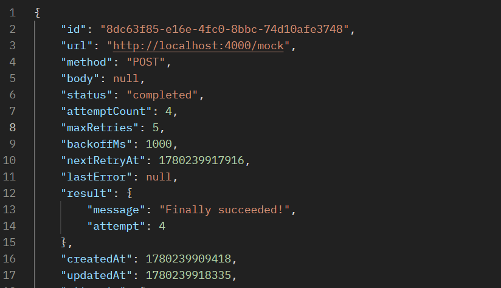
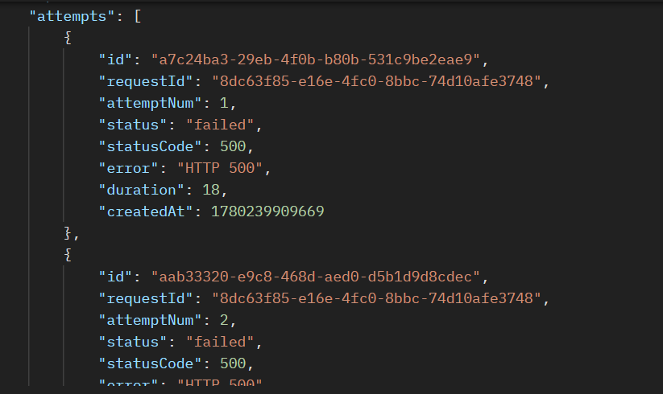

# Retry Engine

A small HTTP service that retries failed requests with exponential backoff and jitter. Built for fintech and e-commerce scenarios where calls to external APIs — payment gateways, SMS providers, banks — sometimes fail and need to be retried safely.

---

## Table of Contents

- [Setup](#setup)
- [Architecture](#architecture)
- [Core Concepts](#core-concepts)
- [API Reference](#api-reference)
- [Screenshot](#screenshot)
- [What I Struggled With](#what-i-struggled-with)
- [What I Learned](#what-i-learned)
- [Resources](#resources)
- [Reflection](#reflection)

---

## Setup

### Requirements

- Node.js 18+
- npm

### Install

```bash
git clone https://github.com/igbonekwu-joy/Dilamme-Retry-Engine.git
cd Dilamme-Retry-Engine
npm install
```

### Run Migrations

```bash
npm run migrate
```

This creates the SQLite database with the `requests` and `attempts` tables.

### Start the Server (Development)

```bash
npm run dev
```

Server runs on `http://localhost:5000`.

### Run the Test Script

You need two terminals for this.

**Terminal 1 — start the mock server:**
```bash
npm run mock
```

**Terminal 2 — run the tests:**
```bash
npm test
```

The test script submits three jobs and prints the attempt history for each — showing backoff doubling, jitter, 4xx terminal behaviour, and dead-lettering.

---

## Architecture

```
Client
  │
  │  POST /request
  ▼
┌─────────────────────────────┐
│         Express API         │
│                             │
│  • Validates the payload    │
│  • Saves job to SQLite      │
│• Returns { id, status: pending }  │
└────────────┬────────────────┘
             │
             │ writes to
             ▼
┌─────────────────────────────┐
│         SQLite DB           │
│                             │
│  requests  — one row/job    │
│  attempts  — one row/try    │
└────────────┬────────────────┘
             │
             │ reads every 500ms
             ▼
┌─────────────────────────────┐
│      Background Worker      │
│                             │
│  • Wakes every 500ms        │
│  • Finds rows where         │
│    nextRetryAt <= now()     │
│  • Locks row immediately    │
│  • Makes the HTTP call      │
│  • On 2xx  → completed      │
│  • On 4xx  → failed (stop)  │
│  • On 5xx  → retrying       │
│  • On max  → dead-letter    │
└────────────┬────────────────┘
             │
             │ fetch()
             ▼
┌─────────────────────────────┐
│      External Service       │
│                             │
│  Payment gateway, SMS       │
│  provider, bank API, etc.   │
└─────────────────────────────┘
```

### Retry Flow

```
Job submitted
      │
      ▼
   pending
      │
      │ worker picks it up
      ▼
  processing
      │
      ├── 2xx ──────────────────→ completed 
      │
      ├── 4xx ──────────────────→ failed (never retries)
      │
      └── 5xx / timeout / network error
                │
                ├── attempts < maxRetries ──→ retrying (wait, then back to processing)
                │
                └── attempts >= maxRetries ─→ failed (dead-letter)
```

---

## Core Concepts

### Why Exponential Backoff Matters

When an external service returns a 500 error, it's usually under load or temporarily down (server error). If you retry immediately, you pile more traffic onto an already struggling server and just make it worse.
Exponential backoff increases the retry space time by doubling the wait time after every attempt.

Exponential backoff spaces retries out by doubling the wait time each attempt. This gives the external service time to recover before each new attempt.

### Why Jitter Matters

Even with exponential backoff, if 500 jobs all failed at the same time they'll all retry at the same time (1 second later, then 2 seconds later, and so on). The wait time only increases, but doesn't spread out, so it remains the same for all jobs.

Jitter breaks this by multiplying the wait time by a random number between `0.8` and `1.2` on every attempt:

```js
const jitter = 0.8 + Math.random() * 0.4;  // fresh re-roll for each attempt
const waitMs = Math.round(baseWait * jitter);
```

Now 500 jobs that all failed at the same time will retry at slightly different times, thereby spreading the load across the server instead of hitting it all at once.

### Why 4xx Shouldn't be Retried

HTTP status codes tell us the nature of the failure:

- **5xx**: server failure. Server was overloaded, crashed, or had a temporary issue. The same request might succeed if we try again later. Therefore, it is worth retrying.
- **4xx**: the request was wrong. A 404 means the resource doesn't exist. A 422 means your data was invalid. A 401 means you're not authenticated. None of these will fix themselves no matter how many times you retry. So retrying just wastes resources and adds noise to logs.

So this is the rule: retry things that could possibly change, stop immediately on things that would never.

---

## API Reference

### `POST /request`

Submit a new job for the worker to process.

**Request body:**
```json
{
  "url": "https://httpbin.org/post",
  "method": "POST",
  "body": { "amount": 1000 },
  "maxRetries": 5,
  "backoffMs": 1000
}
```

| Field | Required | Default | Description |
|---|---|---|---|
| `url` | Yes | — | The external URL to call |
| `method` | Yes | — | HTTP method (GET, POST, PUT, etc.) |
| `body` | No | null | Request body (for POST/PUT) |
| `maxRetries` | No | 5 | Max attempts before dead-lettering |
| `backoffMs` | No | 1000 | Base wait time in ms |

**Response:**
```json
{
  "id": "a3f1c2d4-7e8b-4c2a-9f1d-3b5e6c7d8e9f",
  "status": "pending"
}
```

**curl:**
```bash
curl -X POST http://localhost:5000/request \
  -H "Content-Type: application/json" \
  -d '{"url": "https://httpbin.org/post", "method": "POST", "body": {"hello": "world"}}'
```

---

### `GET /requests/:id`

Get a single request and its full attempt history.

**curl:**
```bash
curl http://localhost:5000/requests/<id>
```

**Response:**
```json
{
  "id": "a3f1c2d4-7e8b-4c2a-9f1d-3b5e6c7d8e9f",
  "url": "https://httpbin.org/post",
  "method": "POST",
  "status": "completed",
  "attemptCount": 3,
  "maxRetries": 5,
  "backoffMs": 1000,
  "lastError": null,
  "result": { "url": "https://httpbin.org/post" },
  "createdAt": 1717000000000,
  "updatedAt": 1717000000000,
  "attempts": [
    {
      "id": "b1c2d3e4-...",
      "requestId": "a3f1c2d4-7e8b-4c2a-9f1d-3b5e6c7d8e9f",
      "attemptNum": 1,
      "status": "failed",
      "statusCode": 500,
      "error": "HTTP 500",
      "duration": 312,
      "createdAt": 1717000000000
    },
    {
      "id": "c2d3e4f5-...",
      "requestId": "a3f1c2d4-7e8b-4c2a-9f1d-3b5e6c7d8e9f",
      "attemptNum": 2,
      "status": "failed",
      "statusCode": 500,
      "error": "HTTP 500",
      "duration": 287,
      "createdAt": 1717000001043
    },
    {
      "id": "d3e4f5g6-...",
      "requestId": "a3f1c2d4-7e8b-4c2a-9f1d-3b5e6c7d8e9f",
      "attemptNum": 3,
      "status": "succeeded",
      "statusCode": 200,
      "error": null,
      "duration": 298,
      "createdAt": 1717000003867
    }
  ]
}
```

---

### `GET /requests?status=`

List requests filtered by status.

**Valid statuses:** `pending`, `processing`, `retrying`, `completed`, `failed`

**curl:**
```bash
# All requests
curl http://localhost:5000/requests

# Only failed
curl "http://localhost:5000/requests?status=failed"

# Only completed
curl "http://localhost:5000/requests?status=completed"

# Only retrying
curl "http://localhost:5000/requests?status=retrying"
```

**Response:**
```json
{
  "total": 2,
  "status": "failed",
  "requests": [ ... ]
}
```

---

## Screenshot

> Screenshot of `GET /requests/:id` showing a request that failed twice then succeeded on the third attempt.





---

## What I Struggled With

- The hardest bug to track down was the worker processing the same job multiple times. Because `fetch()` is async, the worker would pick up a job, start the HTTP call, and then on the next 500ms tick ( before the fetch is returned) pick up the same job again. The job would end up with 2 or 3 attempt rows in the database for what was supposed to be 1 attempt.
The fix was to lock the job synchronously before doing anything async. Since `better-sqlite3` is synchronous, the `UPDATE status = 'processing'` runs and commits instantly — before any `await`. By the time the next worker tick runs, the row is already `processing` and the SELECT query ignores it.

- I initially set `nextRetryAt` only when scheduling a retry, which meant on the first attempt the worker would find the row but `nextRetryAt` was null. I had to set `nextRetryAt = now` at insert time so that the first attempt is picked up immediately.

---

## What I Learned

- I didn't expect a database library to be synchronous, but `better-sqlite3` is, because SQLite is a local file with no network trip. This actually made the locking pattern possible. An async library would have required transactions or a different approach entirely.

- I was aware that retries existed but I had never thought carefully about what happens when hundreds or thousands of clients all retry at the same time. Jitter is a pretty cool fix. Just one line of code, but the reasoning behind it is deep. It changed how I think about any system with coordinated clients.

- I have worked with BullMQ in the past, but I had never built a polling loop from scratch where I have to pick up due rows, lock them, process them, schedule the next attempt. Building this gave me a concrete understanding of what job queueing libraries like BullMQ really do behind the scenes. I now understand why they exist and what problems they solve.

- I knew the rough meaning of 4xx vs 5xx before, but implementing the retry logic forced me to think carefully about what each category really means for retry behaviour. It's not just a number, it's a signal about whether the problem is on your side or theirs.

---

## Resources

- [better-sqlite3 docs](https://github.com/WiseLibs/better-sqlite3/blob/master/docs/api.md): mostly particularly the section on why it's synchronous
- [MDN: fetch API](https://developer.mozilla.org/en-US/docs/Web/API/Fetch_API): reference for fetch options and response handling
- [httpbin.org](https://httpbin.org): used as the mock external API during development for testing specific status codes
- [Node.js: setInterval](https://nodejs.org/en/docs/guides/timers-in-node): understanding the event loop and how setInterval behaves with async callbacks

---

## How This Project Made Me a Better Backend Developer

Before this project I understood retries in the abstract (if it fails, try again), but I didn't understand the engineering behind doing it safely.

What I can do now that I couldn't before:

- **Design a worker loop from scratch.** I know how to poll a database, lock rows to prevent double-processing, and schedule future work using timestamps, without any external queue library.
- **Implement backoff and jitter correctly.** I can explain why they exist and what failure modes they prevent.
- **Think about error classification.** When a request fails I now ask: is this a recoverable error or a permanent one?. That distinction changes how the system responds and prevents wasted work.
- **Debug async timing bugs.** The race condition I hit (retrying already processing jobs, thereby storing multiple rows for one attempt) only appeared because fetch is async and the worker runs every 500ms. Tracking it down taught me to think carefully about what's synchronous, what's async, and what state looks like at each point in time.

In production I'll think differently about any system that makes outbound calls. Retries without backoff can take down a recovering service. Retries without jitter just shift the wait time only. And retrying a 4xx is never the right decision. These aren't abstract rules anymore, I've seen exactly what happens when you get them wrong.